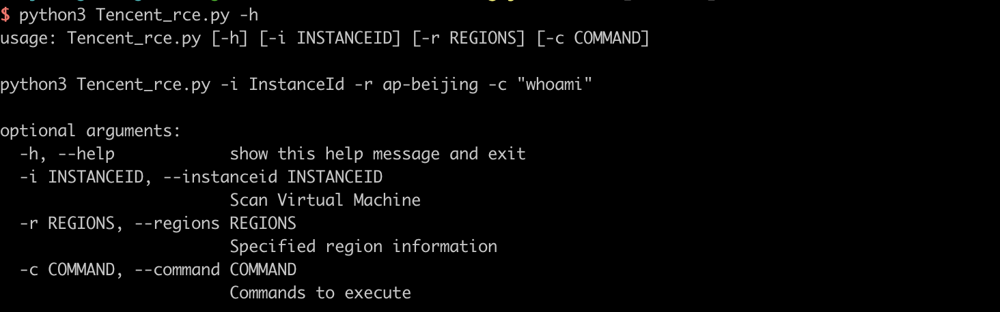
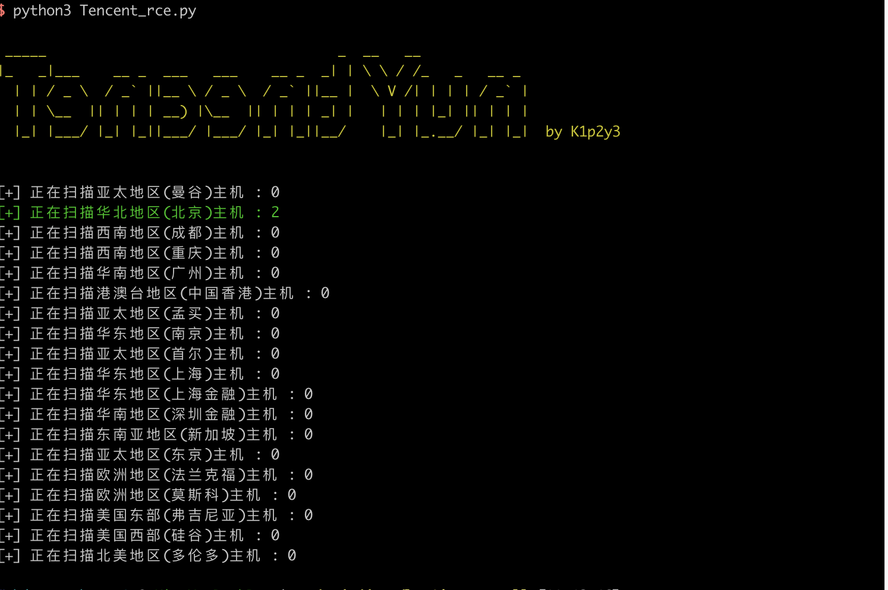
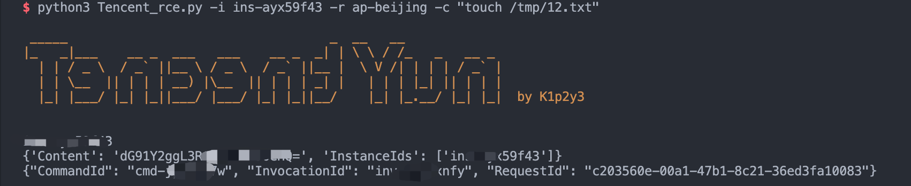

# Tencent_Yun_tools

* 使用 python3.9 +

## > Usage

```
python3 Tencent_rce.py -h
```
 

## > Scanner

```
python3 Tencent_rce.py -s
```
 

## > Runcommand

```
python3 Tencent_rce.py -i ins-ayx59f43 -r ap-beijing -c "touch /tmp/12.txt"

```

 
