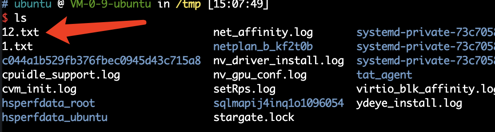

# Tencent_Yun_tools

* 使用 python3.9 + 腾讯云 AccessKey 利用工具

## >  Usage

```python
python3 Tencent_rce.py -h
```
 

## >  Scanner

```python
python3 Tencent_rce.py -s
```
 

* 生成CSV文件

## >  Runcommand

```python
python3 Tencent_rce.py -i ins-xxxxx -r ap-beijing -c "touch /tmp/12.txt"
```

 
 
 
 
